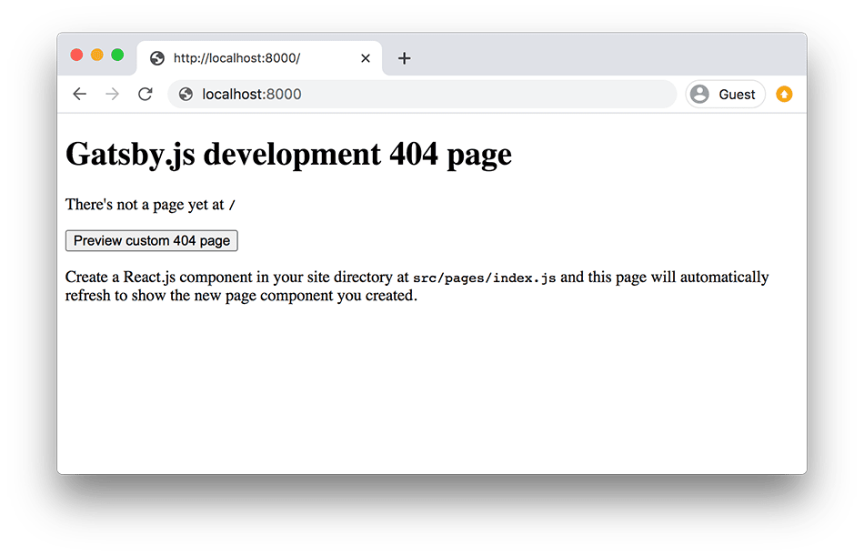
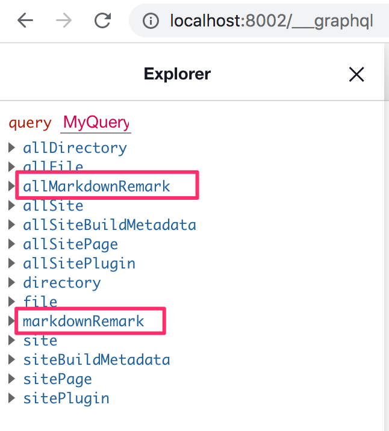

طريقة بناء مدونة باستخدام **Gatsby.js** كان مطلب الكثير من متابعي توتومينا منذ أن أعلنت [نقل المدونة من ووردبريس إلى غاتسبي](/blogging/switching-from-wordpress-to-gatsbyjs/).

تكاسلت عن تلبية هذا الطلب لأنني أعلم يقينا بأنه سيكون درسا طويلا 😅 وبالتالي سيتطلب مني مجهودا ووقتا رأيت أنه من الأفضل تسخيره لنشر أكثر من تدوينة واحدة في مواضيع أخرى تلقى اهتمامكم.

ولكن اليوم انتهى زمن التكاسل والتسويف 💪 قررت أن أنجز هذا الدرس مهما كلف الأمر، المهم أن ينال إعجاب المهتمين ب Gatsby.js ويستفيدوا منه لبناء مدوناتهم الخاصة من الصفر.

يعتبر **واثق الشويطر** من أنشط وأوفى أصدقاء المدونة منذ مدة ليست بالقصيرة.. ورغبة مني في شكره على تفاعله الدائم طلبت منه الإذن لآخذ [مدونته الشخصية](http://watheq.xyz/) كمثال نعمل عليه اليوم، إذ سأحولها بالكامل لمدونة ساكنة مبنية على Gatsby مع جميع المزايا والوظائف التي توفرها:

- قائمة المقالات.
- صفحة المقال مع تعليقات Disqus.
- صفحة التصنيف (Category page).
- صفحة الوسم (Tag page).
- صفحات "عني"، "سياسية الخصوصية" ...
- صندوق البحث.
- صندوق الإشتراك بالقائمة البريدية.
- والمزيد...

سنتطرق لكل هذه الأشياء وأشرحها بالتفصيل **خطوة بخطوة** كما عهدتموني في المدونة.

سيكون الدرس والمقال طويلا ومليئا بالمعلومات، لذلك أنصحك صديقي أن تحضر قهوتك ☕ وتجلس مرتاحا لكي تكمل معي حتى النهاية.

<blockquote>
  <p>
  إذا لم تكن لديك أي خبرة في جافا سكريبت، React.js أو Node.js فمن المحتمل أن تواجه بعض الصعوبات في متابعة الدرس.
  </p>

  <p>
  سأحاول قدر المستطاع تبسيط كل خطوة وشرحها بشكل جيد. إذا كان ذلك غير كافٍ بالنسبة لك فأنصحك بمحرك البحث Google والتوثيق الرسمي ل Gatsby.js لمزيد من التفصيل.
  </p>
</blockquote>

## توضيح

أسرع طريقة للبدء في أي مشروع `Gatsby` هي باستخدام الحزمة `gatsby-cli` التي تمكننا من إنشاء مشروع أولي مع بعض الإعدادات الإفتراضية.

ستجدون تفاصيل أكثر حول هذه الطريقة في [التوثيق الرسمي](https://www.gatsbyjs.com/docs/quick-start/).

**لن ألجأ لهذه الطريقة** في درسنا هذا، لأنني أريد أن أبدأ معكم من الصفر، من مجلد فارغ وبدون أي إعدادات افتراضية لا نعرف كمبتدئين من أين أتت ولماذا.

أتمنى أننا اتفقنا بخصوص هذه النقطة وأنها واضحة بما يكفي.

الآن هيا بنا 🚀

## البداية

كما هو الحال في بداية أي مشروع، أول شيء سنقوم به هو إنشاء مجلد جديد وهذه المرة سيكون اسمه `gatsby-watheq`.

سندخل للمجلد عن طريق نافذة الأوامر السطرية:

```
cd path/to/gatsby-watheq
```

### إنشاء الملف `package.json`

الآن ونحن داخل المجلد الرئيسي لمشروعنا، سنقوم بإنشاء الملف `package.json` أوتوماتيكيا عن طريق الأمر:

```
npm init --y
```

### إضافة الحزم الرئيسية

بعد ذلك سيكون علينا تثبيت 3 مكتبات رئيسية: اثنتان منها هما `react` و `react-dom` اللتان اعتدنا رؤيتهما في أي مشروع ل React.js والثالثة هي بطبيعة الحال حزمة `gatsby`.

```
npm install react react-dom gatsby
```

بعد تثبيت هذه الحزم سيكون علينا إضافة بعض السكريبتات إلى ملف `package.json` حتى يكون بإمكاننا تشغيل Gatsby.js والتحكم فيه بسهولة أكثر من خلال الأوامر السطرية:

```json
"scripts": {
  "build": "gatsby build",
  "clean": "gatsby clean",
  "develop": "gatsby develop"
}
```

هذه الأوامر تضاف كما قلنا في الملف `package.json` وبالتحديد في منطقة `scripts`، بذلك يكون الشكل النهائي لهذا الملف على النحو التالي:

<div class="filename">package.json</div>

```json{7-9}
{
  "name": "gatsby-watheq",
  "version": "1.0.0",
  "description": "",
  "main": "index.js",
  "scripts": {
    "build": "gatsby build",
    "clean": "gatsby clean",
    "develop": "gatsby develop"
  },
  "keywords": [],
  "author": "",
  "license": "ISC",
  "dependencies": {
    "gatsby": "^2.32.4",
    "react": "^17.0.1",
    "react-dom": "^17.0.1"
  }
}
```

الآن بات بإمكاننا تشغيل `Gatsby` عن طريق الأمر `npm run develop` الذي سيفتح الموقع عبر الخادم المحلي من خلال المنفذ `8000`. ولكن لن نحصل سوى على صفحة `404` 😅 لأنه لم نقم إلى حدود اللحظة بإضافة أي محتوى للمشروع.



## البدء بإنشاء مكونات React.js التي سنحتاجها

قبل إضافة أي محتوى للموقع سيكون علينا أولا إنشاء مكون جديد اسمه `Layout` وسيكون بمثابة قالب الحلوى الذي ستوضع فيه كافة صفحات الموقع كما هو واضح من اسمه.

هذا المكون الرئيسي سيكون بداخل المجلد الجديد `components` الذي سننشئه بدوره بداخل مجلد آخر جديد هو `src`.

بتعبير آخر: `src` هو المجلد الرئيسي الذي سيضم كل الشفرة المصدرية البرمجية الخاصة بالمدونة (مكونات React وملفات جافا سكريبت بشكل عام).

_المحتوى سيكون في مجلد آخر بجانب `src` كما سنرى في وقت لاحق._

<div class="filename">src/components/Layout.js</div>

```jsx
import React from 'react';

import Navigation from '../components/Navigation';
import Sidebar from '../components/Sidebar';
import Footer from '../components/Footer';

import '../styles/main.css';

const Layout = ({ children }) => {
  return (
    <div className="page-container">
      <Navigation />
      <div className="sections-container">
        <section className="main-section">{children}</section>
        <section className="side-bar">
          <div className="white-box padding-2">
            <Sidebar />
          </div>
        </section>
      </div>
      <Footer />
    </div>
  );
};

export default Layout;
```

إذا ألقيتم نظرة على بنية HTML الخاصة بمدونة واثق فستلاحظون بأنني حافظت على نفس البنية ولم أغير فيها إلا بعض التفاصيل الصغيرة.

كما هو واضح في `Layout.js`، هناك مكان للمكون `Navigation` الذي يمثل القائمة الرئيسية للمدونة، ومعه المكون `Sidebar` الذي يمثل الشريط الجانبي بطبيعة الحال. وفي الأخير هناك `Footer` الذي يضم كل ما نريد أن يظهر أسفل الموقع.

لاحظ كذلك أننا قمنا باستيراد التنسيق `main.css` الخاص بالمدونة. قمت بنسخه من مدونة واثق كما هو.

الجزء المهم في هذا المكون هو الخاصية `children` التي تمثل المحتوى الديناميكي والمتغير بحسب ما يوضع داخل وسم المكون `Layout`.

<div class="filename" style="text-align: right;">مثال</div>

```jsx
<Layout>هذا المحتوى سيظهر مكان children.</Layout>
```

الصورة التالية تشرح كل ما قلته بطريقة أخرى:


سيكون بإمكانكم كذلك إلقاء نظرة في [مستودع المشروع على Github.com](http://github.com/aissa-bouguern/gatsby-watheq/) حيث كافة الملفات، إذ لا يمكن أن أشرح كل مكون على حدة لأننا لحد الساعة لم نتطرق إلى أي شيء جديد. فقط أكواد JSX و React.js.

## إضافة المحتوى

يمكن إضافة المحتوى للمواقع المبنية على Gatsby.js باستعمال أنواع مختلفة من الملفات مثل `yaml`، `markdown` وغيرهما. وعند الحديث عن المدونات فإن `markdown` هو النوع الأكثر استخداما لسهولة التعامل معه حتى من طرف المستخدم العادي.

لكي نبدأ بإضافة التدوينات إلى مدونتنا سنقوم بإنشاء مجلد جديد اسمه `content` بجانب المجلد `src`، بداخله سنضيف مجلدا آخر باسم `posts` سيضم التدوينات ومجلد آخر يكون اسمه مثلا `pages` من أجل الصفحات مثل "اتصل بنا"، "عني" إلخ...

داخل `posts` سنقوم بإنشاء ملف من نوع `markdown` وليكن اسمه مثلا `the-birth-of-israel-documentary.md`.

في هذا الملف سنضيف محتوى تدونتنا الأولى مع كافة المعلومات المتعلقة بها مثل العنوان، slug (أو الرابط)، التصنيف، الوسوم، تاريخ النشر وغيرها...

<div class="filename">content/posts/the-birth-of-israel-documentary.md</div>

```
---
title: 'مراجعة وثائقي ميلاد إسرائيل The Birth of Israel'
date: 2020-09-16
slug: 'the-birth-of-israel-documentary'
template: 'post'
categories:
  - تاريخ
tags:
  - فلسطين
  - إسرائيل
  - الكيان الصهيوني
  - BBC
  - وثائقي
  - تاريخ
about: 'مراجعة لوثائقي'
updated_at: 2020-09-21
---

شاهدت قبل فترة وثائقي من BBC يتحدث الوثائقي عن نشأة إسرائيل بمناسبة مرور 60 سنة على ذكرى قيامها المشئوم. اهتممت بالوثائقي لأنه يعرض وجهة النظر البريطانية للموضوع ويقدمها بالأساس للمشاهد الغربي باللغة الإنجليزية. اهتممت به لأرى ك يتعامل الإعلام الغربي مع القضية الفلسطينية وما الرؤية التي يقدمها خلاف الرؤية المحسومة الواضحة لدينا نحن العرب والمسلمين.

كان هناك أسلوب مسك العصا من الوسط، والظهور بمظهر المحايد في أسلوب القناة والمساواة بين الجلاد والضحية. كان هناك لقاء مع "شمعون بيريز" الرئيس الإسرائيلي الأسبق وغيره من الشخصيات الإسرائيلية والشخصيات العربية.

لاحظت في نبرة حديث الإسرائيليين الغرور الشديد حيث يقول شمعون بيريز أنهم [أي الإسرائيليين] طوّروا منذ أيامهم الأولى أفضل زراعة ربما على الأرض.
```

إلى الآن ستظل صفحة `404` تظهر في الموقع لأننا نعم أضفنا المحتوى ولكننا لم نقل بعد لغاتسبي أن ذلك المحتوى موجود ولم نعلمه كيف يأخذه ويحوله لصفحات.

## الإضافات

لكي يكون بمقدور `Gatsby` تقديم أنواع مختلفة من المحتويات وقراءة أنواع مختلفة من الملفات فإنه يعتمد على نظام للإضافات كالذي موجود لدى ووردبريس وغيره. هذه الإضافات تضيف إمكانيات جديدة وتسمح لمجتمع المطورين بالمساهمة في تطوير بيئة `Gatsby` وجعلها غنية أكثر وأكثر. ولعل هذه نقطة قوة ووربريس الأولى والتي جعلت منه ما هو عليه اليوم.

لكي نقوم بقراءة الملف `the-birth-of-israel-documentary.md` الذي أنشأناه لتونا، سنعتمد على إضافتين اثنتين لا ثالث لهما:

- `gatsby-source-filesystem`
- `gatsby-transformer-remark`

الأولى تسمح لجاتسبي بقراءة الملفات من نظام الملفات Filesystem عندنا، والثانية تأخذ ما قرأته الأولى وتساعد في تفسير (Parse) المعلومات الواردة فيه بصيغة Markdown، مما يسمح ويتيح لجاتسبي **تحويل** تلك المعلومات إلى أشياء يستطيع المستخدم أو المطور الإستعلام عليها بواسطة `Graphql`.

نظام متكامل كل جزء فيه يقوم بمهمة محددة بدقة.

`gatsby-transformer-remark` هي إضافة **تفسير وتحويل**، ويمكننا استخدام إضافات أخرى من هذا النوع إذا كنا نود جلب أنواع أخرى من المحتويات غير Markdown. فمثلا هناك:

- `gatsby-transformer-json`
- `gatsby-transformer-yaml`
- إلخ...

بدون أن نطنب أكثر في الحديث، سنقوم بتثبيت تلك الحزمتين في مشروعنا:

```
npm install gatsby-source-filesystem gatsby-transformer-remark
```

نحن الآن قمنا بتحميل الإضافتين وتثبيتهما في مشروعنا، ولكن لم نخبر بعد صديقينا جاتسبي عن كيفية الإستعانة بهما لقراءة ملفاتنا الموجودة داخل المجلد `content`.

دعونا نقوم بإضافة تلك الإعدادات فورا ..

أول خطوة هي إنشاء ملف جديد اسمه `gatsby-config.js` في المجلد الرئيسية للمشروع. هذا الملف سيضم كافة الإضافات التي تضاف لمشروع Gatsby مع إعداداتها الخاصة.

بعد إنشاء الملف نضع فيه الكود الآتي:

<div class="filename">gatsby-config.js</div>

```js
module.exports = {
  plugins: [
    {
      resolve: 'gatsby-source-filesystem',
      options: {
        path: 'content',
      },
    },
    {
      resolve: `gatsby-transformer-remark`,
    },
  ],
};
```

لاحظوا أننا في هذا الملف نقوم بتصدير كائن جافاسكريبت يضم خاصية على شكل مصفوفة اسمها `plugins`. هذه المصفوفة تمثل كافة الإضافات التي نريد استخدامها بمدونتنا.

لحد الساعة توجد إضافتان فقط! ويمكنكم ملاحظة كيف أخبرنا `gatsby-source-filesystem` بأن عليها البحث في المجلد `content` عن ملفات المحتوى، وذلك عبر الخاصية `options` التي نضع بداخلها إعدادات كل إضافة على حدة.

الآن إذا فتحنا الرابط `http://localhost:8002/___graphql` سنلاحظ بأنه تمت إضافة نوعين جديدين من **الإستعلامات** إلى خادم Graphql الخاص بجاتسبي، وهما: `allMarkdownRemark` و `markdownRemark` كما هو واضح في الصورة أدناه.



هذان الإستعلامان (Queries) الجديدان سيمكناننا ـ كما سنكتشف بعد قليل ـ من طلب التدوينات التي أنشأناها وذلك باستخدام لغة الإستعلامات GraphQL مع React.js.

## بناء الصفحات

الآن لدينا كل الأدوات اللازمة لبناء وإنشاء صفحات في Gatsby.

لدينا ملفات المحتوى على شكل صيغة مارك داون، ولدينا استعلامات GraphQL لطلب محتويات تلك الملفات.

قبل أن نبدأ في إنشاء أي صفحة، يجب أن نعلم أن هناك في جاتسبي **ثلاث طرق** متاحة لإنشاء الصفحات:

- الطريقة الأولى: عن طريق إنشاء مكونات رياكت في المجلد `src/pages`، بشرط أن يتم تصدير تلك المكونات على شكل Default export. هذه الطريقة نجدها متبعة في مختلف أطر عمل جافاسكريبت المعروفة مثل Next.js وكذلك Nuxt.js.

- الطريقة الثانية: عن طريق `File System Route API` الذي يسمح لنا بإنشاء صفحات محقونة ببيانات GraphQL، مع إمكانية بناء صفحات **ناحية العميل فقط**. هذه الأخيرة ميزة مهمة وسنستخدمها في صفحة البحث، حيث أن نتائج البحث من بين الصفحات التي لا يمكن توليدها في مرحلة Build لأنها متعلقة بمدخلات المستخدم.

- الطريقة الثالثة: عن طريق الملف `config-node.js` والواجهة البرمجية `createPages`. هذه الطريقة لا تستخدم إلا عندما نصل [للحدود القصوى للطريقة الثانية](https://www.gatsbyjs.com/blog/fs-route-api/). يعني أننا لا نلجأ إليها إلا في حالات خاصة لا تجدي فيها واجهة `File System Route API`.

### بناء الصفحة الرئيسية

سنتبع الطريقة الأولى لإنشاء الصفحة الرئيسية. لذلك سنضيف الملف `src/index.js` وبداخله الكود التالي:

<div class="filename">src/index.js</div>

```jsx
import React from 'react';
import { graphql, useStaticQuery } from 'gatsby';
import { Helmet } from 'react-helmet';

import Layout from '../components/layout';
import PostList from '../components/post-list';
import Seo from '../components/Seo';

import config from '../siteConfig';

const Home = () => {
  const data = useStaticQuery(graphql`
    query {
      allMarkdownRemark(
        sort: { fields: frontmatter___date, order: DESC }
        filter: { frontmatter: { template: { eq: "post" } } }
      ) {
        edges {
          node {
            frontmatter {
              slug
              title
              template
              categories
              about
              date(formatString: "DD-MM-YYYY")
              updated_at(formatString: "DD-MM-YYYY")
            }
          }
        }
      }
    }
  `);

  const posts = data.allMarkdownRemark.edges;

  return (
    <Layout>
      <Seo />
      <Helmet>
        <title>{config.siteTitle}</title>
      </Helmet>
      <div className="white-box padding-2">
        <PostList posts={posts} />
      </div>
    </Layout>
  );
};

export default Home;
```

لاحظ كيف استخدمنا الخطاف `useStaticQuery` لجلب البيانات من خادم GraphQL، ومن خلاله استطعنا الوصول للتدوينات `posts` التي مررناها للمكون `PostList` ليقوم بعرضها.

وإذا ألقيتم نظرة على الطلب `allMarkdownRemark` فستلاحظون أننا طلبنا منه أن يجلب لنا فقط المحتويات حيث الخاصية `template` في الترويسة (frontmatterr) تساوي `post`. فنحن لا نريد عرض الصفحات مثل "اتصل بنا" ضمن قائمة المقالات بالصفحة الرئيسية 😄

إلى جانب `PostList`، هناك مكون جديد أنشأناه اسمه `Seo` وفيه كل ما يتعلق بالوسول التي نجدها عادة داخل الوسم `<head>` في صفحة `html` والتي تلعب دورا مهما لجعل صفحاتنا صديقة لمحركات البحث ومنصات التواصل الإجتماعي.

كل ذلك بفضل الحزمة `react-helmet` التي قمت بتثبيتها بواسطة `npm` والتي تقوم بإضافة أي كود `html` موجود داخل المكون `<Helmet>` إلى الوسم `<head>` في الصفحة.

أتمنى أن تكون هذه الجزئية واضحة. إذا لم تكن كذلك فيمكنك صديقي العزيز أن تلقي نظرة سريعة [لتوثيق](https://www.npmjs.com/package/react-helmet) `react-helmet` لتفهم أكثر آلية عملها.

> المكونان `<Seo />` و `<PostList />` أنشأناهما بأنفسنا وستجدهما في الكود، بينما المكون `<Helmet />` جاء من مكتبة `react-helmet` 😉

### إنشاء صفحة 404

بنفس الطريقة سنضيف الصفحة 404 التي تظهر عندما لا يتم إيجاد الصفحة المناسبة لرابط محدد. لننشئ الملف `src/404.js` ونضيف بداخله هذا الكود:

<div class="filename">src/404.js</div>

```jsx
import React from 'react';
import { Link } from 'gatsby';
import { Helmet } from 'react-helmet';

import Layout from '../components/layout';
import Seo from '../components/Seo';

import config from '../siteConfig';

const NotFound = () => {
  return (
    <Layout>
      <Seo />
      <Helmet>
        <title>{config.siteTitle}</title>
      </Helmet>
      <div className="white-box padding-2">
        <div className="results-container main-border margin-3">
          <div className="background-1">
            <>
              <h4 className="no-margin padding-1 results-head">
                عفواً لا توجد لدينا صفحة بهذا العنوان!
              </h4>
              <p className="go-home-link padding-1 no-margin">
                <Link to="/">&lt;&lt; العودة للصفحة الرئيسية</Link>{' '}
              </p>
            </>
          </div>
        </div>
      </div>
    </Layout>
  );
};

export default NotFound;
```

> تصدير المكون على شكل `default` **ضروري** حتى يعتبره `Gatsby.js` كصفحة.

### إضافة الصفحات والتدوينات

سنستمر في إضافة الصفحات المتبقية، دائما باستخدام واجهة `File System Route API`، وذلك بإنشاء ملف جديد داخل المجلد `pages` يكون اسمه `{MarkdownRemark.parent__(File)__name}.js`.

**الإسم هنا مهم** لكي يفهمه جاتسبي. حيث أنه يخبر الأخير بأن يبحث في جميع ملفات المحتوى (Markdown files) ويقول بتوليد روابط تساوي الإسم الذي اخترناه للملف.

مثلا إذا كان اسم ملف markdown هو `learn-gatsby.md`، فإن الرابط المولد سيكون هو `/learn-gatsby`.

هنا [شرح إضافي](https://www.gatsbyjs.com/docs/reference/routing/file-system-route-api/) لهذه الجزئية في حال أردت صديقي الإستزادة أكثر.

#### الكود

الشفرة المصدرية للملف `{MarkdownRemark.parent__(File)__name}.js` ستكون على النحول الآتي:

```jsx
import React from 'react';
import { graphql } from 'gatsby';
import Helmet from 'react-helmet';

import Layout from '../components/layout';
import Page from '../components/page';
import Post from '../components/post';
import Seo from '../components/Seo';

import config from '../siteConfig';

export default ({ data, uri }) => {
  const post = data.markdownRemark;

  return (
    <Layout>
      <Helmet>
        <title>{`${post.frontmatter.title} – ${config.siteTitle}`}</title>
      </Helmet>

      <Seo postPath={uri} postNode={post} postSEO />

      {post.frontmatter.template === 'page' ? (
        <Page post={post} />
      ) : (
        <Post post={post} />
      )}
    </Layout>
  );
};

export const query = graphql`
  query($id: String!) {
    markdownRemark(id: { eq: $id }) {
      frontmatter {
        title
        categories
        tags
        template
        date(formatString: "DD-MM-YYYY")
        updated_at(formatString: "DD-MM-YYYY")
      }
      html
    }
  }
`;
```

لاحظوا كيف طلبنا من جاتسبي جلب المعلومات من ملفات المحتوى عن طريق الطلب `markdownRemark`. ال `id` المستخدم داخله خاص ب `Gatsby`، إذ يستعين به لتعريف كل صفحة على حدة.

نتيجة الطلب أو Query تحقن مباشرة في المكون الإفتراضي المصدر من هذا الملف. نأخذ منها `data` و `uri` اللذان نحتاجهما في مثالنا.

باقي الكود أظنه سهل ومألوف، فقط نعرض المكون `<Page />` الذي أنشأناه لعرض محتوى الصفحات (وليس التدوينات)، بينما يتولى `<Post />` عرض محتوى التدوينات.

هناك فروقات طفيفة بينهما، إذ أننا مثلا أضفنا صندوق التعليقات `Disqus` أسفل التدوينات بينما لا داعي له في الصفحات.. مثل هذه الأمور هي مجرد كود React.js اعتيادي، لن أشرحه أكثر حتى لا يصبح هذا المقال وكأنه كتاب إلكتروني 😃 سبق وأن نبهت إلى أن المفترض في من يريد تعلم Gatsby الإلمام بإطار العمل React.js والأفكار التي بني عليها.

على كل حال ستجد الرابط نحو الكود المصدري كاملا في نهاية هذه التدوينة 👇

<blockquote style="border-color: #7bcbe3; background: #f1fcff;">
  <p>
   إضافة صندوق التعليقات أسفل التدوينة تم باستخدام الحزمة <code>disqus-react</code> التي يمكن تثبيتها بكل سهولة عن طريق <code>npm</code>، واستعمال المكون <code>DiscussionEmbed</code> الذي نمرر له إعدادات حسابنا الذي فتحناه لهذا الغرض على موقع <code>disqus.com</code>. 
   </p>
   <p>
    الطريقة غاية في الوضوح كما سترى في الملف `src/components/post.js`.
   </p>
</blockquote>

## إنشاء صفحات التصنيفات والوسوم

الآن سنكون مضطرون للإستعانة بالطريقة الثالثة لإنشاء الصفحات في Gatsby.js، عن طريق الملف `gatsby-node.js`.

الفكرة ببساطة هي أننا سنستعلم على جميع التدوينات ونستخلص من كل واحدة على حدة تصنيفاتها (Categories) ووسومها (Tags). بعد ذلك نقوم بتخزين هذه الوسوم في مصفوفات من نوع `Set` ونقوم بتوليد **صفحة لكل تصنيف ولكل وسم**.

<blockquote style="border-color: #7bcbe3; background: #f1fcff;">
  <p>
   تستعمل <code>Set</code> في جافا سكريبت عادة لتخزين قيم غير مكررة (Unique values)، وهذا أهم ما يميزها عن المصفوفة العادية (Array). لذلك استعملناها هنا لكي لا يتم تولين الصفحة مرتين لنفس التصنيف أو الوسم.
   </p>
</blockquote>

إليكم الكود الذي سنضيفه في ملفنا الجديد `gatsby-node.js` الموجود في جذر مشروعنا (Project root)، جنبا إلى جنب مع المجلد `src` (وليس داخله).

<div class="filename">gatsby-node.js</div>

```js
const kebabCase = require('lodash/kebabCase');

exports.createPages = async ({ actions, graphql, reporter }) => {
  const categoryTemplate = require.resolve('./src/templates/category.js');
  const tagTemplate = require.resolve('./src/templates/tag.js');

  const result = await graphql(`
    query {
      allMarkdownRemark(
        sort: { fields: frontmatter___date, order: DESC }
        filter: { frontmatter: { template: { eq: "post" } } }
      ) {
        edges {
          node {
            frontmatter {
              categories
              tags
            }
          }
        }
      }
    }
  `);
  if (result.errors) {
    reporter.panic('error loading posts', result.errors);
    return;
  }

  const posts = result.data.allMarkdownRemark.edges;

  const categoriesSet = new Set();
  const tagsSet = new Set();

  posts.forEach((post) => {
    const { categories, tags } = post.node.frontmatter;

    if (categories) {
      categories.forEach((category) => {
        categoriesSet.add(category);
      });

      const categoriesList = Array.from(categoriesSet);
      categoriesList.forEach((category) => {
        actions.createPage({
          path: `/categories/${kebabCase(category)}/`,
          component: categoryTemplate,
          context: {
            category,
          },
        });
      });
    }

    if (tags) {
      tags.forEach((tag) => {
        tagsSet.add(tag);
      });

      const tagsList = Array.from(tagsSet);
      tagsList.forEach((tag) => {
        actions.createPage({
          path: `/tags/${kebabCase(tag)}/`,
          component: tagTemplate,
          context: {
            tag,
          },
        });
      });
    }
  });
};
```

نلاحظ أن توليد الصفحات يتم داخل الدالة `createPages` عن طريق الوظيفة `createPage` التي يتم تنفيذها بعدد الصفحات المولدة داخل `forEach`.

يمكن كذلك ملاحظة أنه مع كل صفحة مولدة يتم حقن قيمة التصنيف `category` أو الوسم `tag` داخل الكائن `context` ليتم استخدامها في القالبين `categoryTemplate` و`tagTemplate` كما سنرى بعد قليل.

القالب `categoryTemplate` سيكون محتواه شيئا شبيها بما يلي:

<div class="filename">src/templates/category.js</div>

```jsx
import React from 'react';
import Helmet from 'react-helmet';
import { graphql } from 'gatsby';

import Layout from '../components/layout';
import PostList from '../components/post-list';
import Seo from '../components/Seo';

import config from '../siteConfig';

export default function CategoryTemplate({ pageContext, data }) {
  const { category } = pageContext;

  const posts = data.allMarkdownRemark.edges;

  return (
    <Layout>
      <Seo />
      <Helmet
        title={`منشورات في التصنيف "${category}" – ${config.siteTitle}`}
      />
      <div className="white-box padding-2">
        <PostList posts={posts} />
      </div>
    </Layout>
  );
}

export const pageQuery = graphql`
  query($category: String) {
    allMarkdownRemark(
      sort: { fields: frontmatter___date, order: DESC }
      filter: {
        frontmatter: {
          categories: { in: [$category] }
          template: { eq: "post" }
        }
      }
      limit: 100
    ) {
      edges {
        node {
          frontmatter {
            slug
            title
            template
            categories
            about
            date(formatString: "DD-MM-YYYY")
            updated_at(formatString: "DD-MM-YYYY")
          }
        }
      }
    }
  }
`;
```

نلاحظ أن قالب التصنيف شبيه جدا بقالب الصفحة الرئيسية حيث قائمة المقالات. الفرق الوحيد هنا أننا نطلب من GraphQL أن يجلب لنا فقط التدوينات الموجودة تحت التصنيف الذي تم حقنه سابقا من ملف `gatsby-node.js` (هل تذكره ؟) داخل `context` والتقطناه هنا لإستعماله وتمريره للطلب `query` كبارامتر `$category`.

سنقوم بنفس الشيء بالنسبة لقالب الوسم، الفرق الوحيد سيكون في استعلام GraphQL، حيث سنستعمل هنا الفلترة ب `tag` عوض `category`.

<div class="filename">src/templates/tag.js</div>

```jsx
import React from 'react';
import Helmet from 'react-helmet';
import { graphql } from 'gatsby';

import Layout from '../components/layout';
import PostList from '../components/post-list';
import Seo from '../components/Seo';

import config from '../siteConfig';

const TagTemplate = ({ pageContext, data }) => {
  const { tag } = pageContext;
  const posts = data.allMarkdownRemark.edges.filter(
    (post) => post.node.frontmatter.template === 'post'
  );

  return (
    <Layout>
      <Seo />
      <Helmet title={`منشورات في الوسم "${tag}" – ${config.siteTitle}`} />
      <div className="white-box padding-2">
        <PostList posts={posts} />
      </div>
    </Layout>
  );
};

export default TagTemplate;

export const pageQuery = graphql`
  query($tag: String) {
    allMarkdownRemark(
      sort: { fields: frontmatter___date, order: DESC }
      filter: { frontmatter: { tags: { in: [$tag] } } }
      limit: 100
    ) {
      edges {
        node {
          frontmatter {
            slug
            title
            template
            categories
            about
            date(formatString: "DD-MM-YYYY")
            updated_at(formatString: "DD-MM-YYYY")
          }
        }
      }
    }
  }
`;
```

## إضافة استمارة القائمة البريدية

استمارة القائمة البريدية، والتي اخترنا لها في مثالنا هذا منصة Mailchmp، عبارة عن مكون رياكت يعرض كود HTML الذي حصلنا عليه من حسابنا على منصة [مايل شمب](https://mailchimp.com/).

فقط قم بنسخ الكود من هنالك والصقه عندك في المكون مع بعض التنسيق عن طريق CSS طبعا.

<div class="filename">src/components/sidebar/Newsletter.js</div>

```jsx
import React from 'react';

import config from '../../siteConfig';

const Newsletter = () => (
  <div className="the-ad-container main-border margin-3">
    <div className="the-ad-header padding-1">
      <h4 className="no-margin in-block">اشترك في القائمة البريدية</h4>
    </div>
    <div className="padding-1">
      <form
        action={config.mailchimpActionUrl}
        method="post"
        id="mc-embedded-subscribe-form"
        name="mc-embedded-subscribe-form"
        className="validate"
        target="_blank"
        noValidate=""
      >
        <div id="mc_embed_signup_scroll">
          <input
            type="email"
            name="EMAIL"
            className="email"
            id="mce-EMAIL"
            placeholder="أدخل بريدك الالكتروني هنا"
            required=""
          />

          <div id="fake-input" aria-hidden="true">
            <input
              type="text"
              name="b_e89e9cac4b887c5ca51a7bfa8_d4d17540ed"
              tabIndex="-1"
              defaultValue=""
            />
          </div>
          <div className="clear">
            <input
              type="submit"
              value="تأكيد الاشتراك"
              name="subscribe"
              id="mc-embedded-subscribe"
              className="button"
            />
          </div>
        </div>
      </form>
    </div>
  </div>
);

export default Newsletter;
```

## حقل البحث في المدونة

لإضافة خاصية البحث لمدونتنا سنستعين مرة أخرى بواجهة `File System Route API`.

الفكرة هي أننا سنقوم بإنشاء صفحة في المسار `pages/search/[term].js` وستقوم باستقبال كلمة البحث على شكل بارامتر في الراوتر. هذا البارامتر أسميته `term` وكما ترون تم وضعه بين `[ ]` كما يتوقع Gatsby.js.

إذن بمجرد الدخول إلى المسار `/search/example` مثلا، فإنه سيتم حقن الكلمة `example` في كائن اسمه `params` داخل الخاصية الأم `props` التي تمثل مجموع خصائص المكون.

ما يهمنا نحن هنا هو الكائن `params` فقط، الذي نأخذ منه قيمة `term`.

عندما نأخذ تلك القيمة في `term` فإننا نسخدمها لفلترة مجموع التدوينات ونأخذ فقط التدوينات التي تتضمن تلك الكلمة في عناوينها. هذه أبسط طريقة يمكن أن نبني بها خاصية البحث في المدونة.

**ما يجب استيعابه جيدا، أن تلك الفلترة كما قلت تتم في Runtime وليس في Build time كباقي الصفحات!**

هذا يعني أن `/search/[term].js` الذي أنشأناه قبل لحظات هو Client side route لأنه مرتبط بمدخلات المستخدم لمدونتنا، إذ لا يمكن بطبيعة الحال توليد وتجهيز جميع صفحات نتائج البحث مع جميع الكلمات والتوليفات الممكنة في build time 💁‍♂️

<div class="filename">src/pages/search/[term].js</div>

```jsx
import React from 'react';

import Search from '../../components/client/Search';

export default function(props) {
  const searchTerm = props.params['term'];

  return <Search searchTerm={searchTerm} />;
}
```

<div class="filename">src/components/client/Search</div>

```jsx
import React from 'react';
import { useStaticQuery, graphql, Link } from 'gatsby';
import { Helmet } from 'react-helmet';

import Layout from '../layout';
import Seo from '../Seo';
import PostList from '../post-list';

import config from '../../siteConfig';

const Search = ({ searchTerm }) => {
  const data = useStaticQuery(graphql`
    query {
      allMarkdownRemark(
        sort: { fields: frontmatter___date, order: ASC }
        filter: { frontmatter: { template: { eq: "post" } } }
        limit: 100
      ) {
        edges {
          node {
            frontmatter {
              slug
              title
              template
              categories
              about
              date
              updated_at
            }
          }
        }
      }
    }
  `);

  // Filtering
  const posts = React.useMemo(
    () =>
      searchTerm
        ? data.allMarkdownRemark.edges.filter((post) =>
            post.node.frontmatter.title
              .toLowerCase()
              .includes(searchTerm.toLowerCase())
          )
        : [],
    [searchTerm]
  );

  return (
    <Layout>
      <Seo />
      <Helmet title={config.siteTitle} />
      <div className="white-box padding-2">
        <div className="results-container main-border margin-3">
          <div className="background-1">
            {posts.length ? (
              <h4 className="no-margin padding-1 results-head">نتائج البحث</h4>
            ) : (
              <>
                <h4 className="no-margin padding-1 results-head">
                  عفواً لا توجد نتائج مطابقة، حاول البحث باستخدام كلمات أخرى
                </h4>
                <p className="go-home-link padding-1 no-margin">
                  <Link to="/">&lt;&lt; العودة للصفحة الرئيسية</Link>{' '}
                </p>
              </>
            )}
          </div>
        </div>

        <PostList posts={posts} />
      </div>
    </Layout>
  );
};

export default Search;
```

يتبقى فقط أن نطلب من Router توجيه المستخدم إلى صفحة نتائج البحث - بواسطة المكون `Link` الذي يوفره Gatsby - عند النقر على زر البحث في الصندوق الموجود في الشريط الجانبي (Sidebar):

<div class="filename">src/components/sidebar/Search.js</div>

```jsx{19,21}
import React from 'react';
import { Link } from 'gatsby';

import search from '../../images/search.svg';

const Search = () => {
  const [searchTerm, setSearchTerm] = React.useState('');

  return (
    <div className="search-container main-border margin-3">
      <form>
        <input
          className="text-base"
          type="text"
          placeholder="ابحث في المدونة..."
          value={searchTerm}
          onChange={(e) => setSearchTerm(e.target.value)}
        />
        <Link to={`/search/${searchTerm}`}>
          
        </Link>
      </form>
    </div>
  );
};

export default Search;
```

## في الختام

هكذا نكون قد مررنا أهم مكونات مدونة واثق الشويطر والتي نجدها كذلك في أي مدونة أخرى.

غرضنا من هذا الدرس هو أن نتعلم كيف يعمل مولد المواقع الساكنة Gatsby.js، وكذلك كيفية إنشاء الصفحات عن طريق الإستعلام نحو خادم GraphQL.

باقي الأمور مجرد كود React.js من المفروض ألا يشكل لك مصدرا للصداع أو التوجس مادمت قد سبق لك التعامل مع تلك المكتبة واستوعبت أساسياتها.

هذا الدرس طويل.. أعلم ذلك 😄 ولقد حاولت قدر المستطاع ألا يكون أطول من ذلك حتى لا يمل القارئ والمتعلم، ولكن في نفس الوقت لم أرد حرق أي مرحلة أو ترك أي هوة في موضوع بناء مدونة بواسطة Gatsby.js من الصفر.

أتمنى أن الدرس كان مفيدا، **ودائما هناك صندوق التعليقات للتفاعل والإستفسارات**.

<p style="text-align: center;">
  <a href="https://github.com/aissa-bouguern/gatsby-watheq" target="_blank" title="رابط المشروع على Github">
    رابط المشروع على Github
  </a>
</p>

<Author slug="aissa" />
